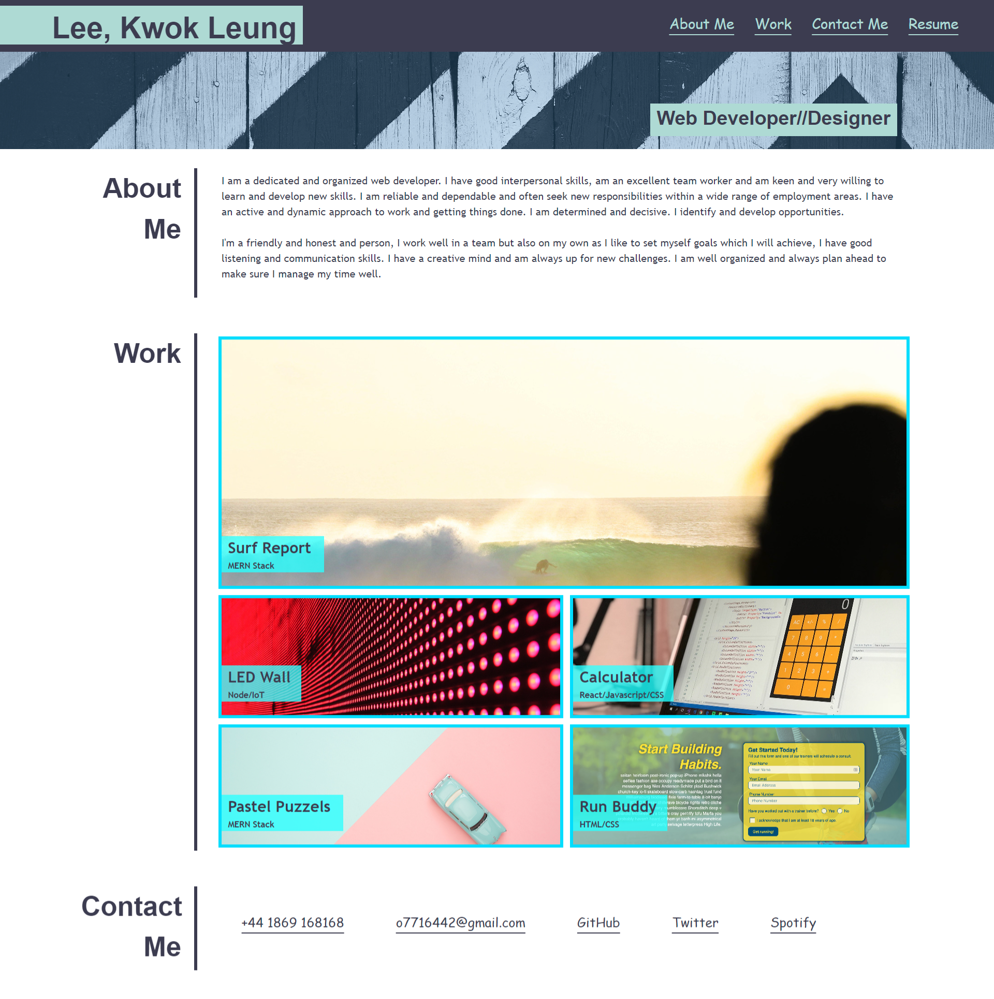

# portfolio-page
Unit 2 Challenge: Portfolio

## Description

A portfolio of work can showcase your skills and talents to employers looking to fill a part-time or full-time position. An effective portfolio highlights your strongest work as well as the thought processes behind it. A web developer who have portfolios with deployed web applications (meaning they are live on the web) are typically very successful in their career search after the boot camp. This last point can’t be stressed enough: having several deployed projects is a minimum requirement to receive an initial interview at many companies.

you’ll set yourself up for future success by applying the core skills you've recently learned: flexbox, media queries, and CSS variables. You'll get to practice your new skills while creating something that you will use during your job search. It’s a win-win that you'll likely be grateful for in the future!

### User Story

AS A web developer, I WANT to practice my new skills while creating something that I shall use during my job search.

### Acceptance Criteria

Here are the critical requirements necessary to develop a portfolio that satisfies a typical hiring manager’s needs:

* When the page is loaded the page presents your name, a recent photo or avatar, and links to sections about you, your work, and how to contact you
* When one of the links in the navigation is clicked then the UI scrolls to the corresponding section
* When viewing the section about your work then the section contains titled images of your applications
* When presented with the your first application then that application's image should be larger in size than the others
* When images of the applications are clicked then the user is taken to that deployed application
* When the page is resized or viewed on various screens and devices then the layout is responsive and adapts to my viewport

### Mock up

The following image shows the web application's appearance and functionality:

### Review

TA, a Web Developer, reviews the code, providing feedback on errors and making sure that all of the acceptance criteria have been met.

* [The URL of the deployed application.](https://seacrest3.github.io/horiseon-webpage/)

* [The URL of the GitHub repository.](https://github.com/seacrest3/horiseon-webpage.git)